# Schnellstart-Anleitung

- Lade die Datei "Desktop-bitrate-monitor-x.x.x-setup.exe" herunter

  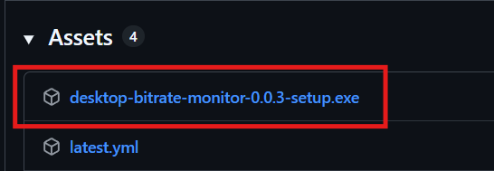

- Starte den Installer
  - Es kann eine Sicherheitswarnung erscheinen. Das passiert, weil die App nicht code-signiert ist
- Wähle deine Plattform und konfiguriere dein Konto
  - Der aktivierte Schalter zeigt, welche Plattform aktuell für das Chat-Listening aktiv ist
- Konfiguriere deinen Statistik-Server
- Verbinde deine Broadcasting-Software per WebSocket (OBS WebSocket 5.x oder höher)
  - Wenn die Zugangsdaten korrekt sind, wird die Verbindung automatisch hergestellt
- Wenn alles korrekt verbunden ist:
  - Beide Verbindungsanzeigen werden grün
  - Dein Kontoname wird angezeigt

Sobald du einen SRT-Feed startest und der Server Statistiken veröffentlicht, siehst du Live-Daten im Diagramm.

---

# Dashboard

<details>
	<summary> Alle Dashboard-Beschreibungen anzeigen </summary>

#### Ansicht des vollständigen Dashboards und kurze Beschreibungen der Komponenten

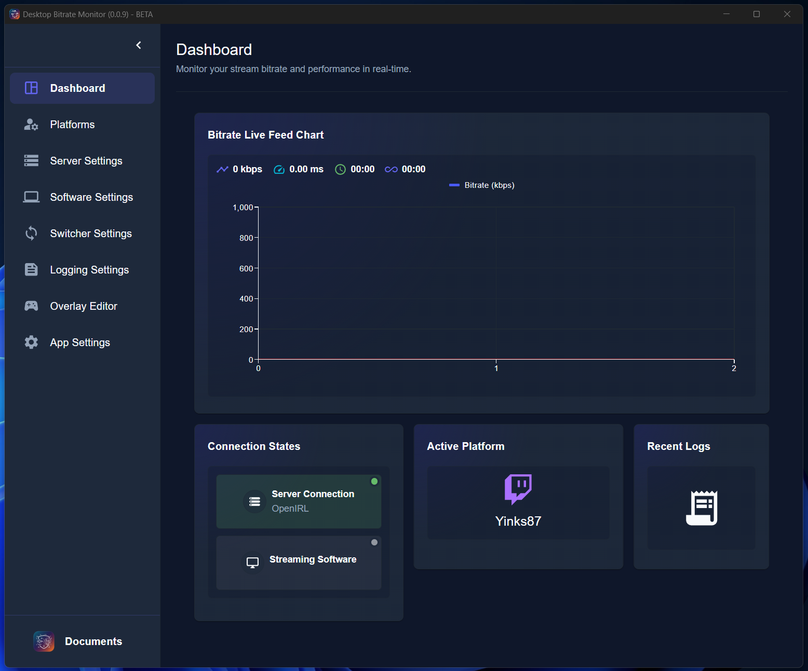
<ol>
	<li>Navigations-Seitenleiste mit allen Bereichen</li>
		<ul>
			<li>Der Plattform-Button öffnet eine Karte, um die aktive Plattform zu ändern und zu den Plattform-Einstellungen zu wechseln</li>
			<li>Es ist nur eine aktive Plattform erlaubt</li>
			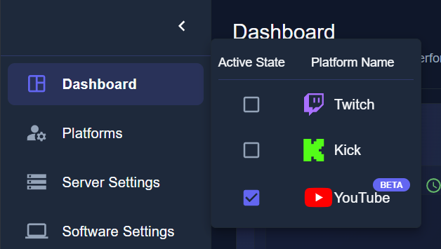
			/ul>
	<li>Umschalt-Button zum Ein-/Ausklappen der Seitenleiste (Status wird gespeichert)</li>
	<li>Vollständiges Feed-Diagramm</li>
		<ul>
			<li>Zeigt die Live-Bitrate als Liniendiagramm der Haupt-Serverinstanz (oberste Instanz in der Liste)</li>
		</ul>
		<ul>
			<li>Wähle eine History-Logdatei aus und zeige die Statistiken an</li>
			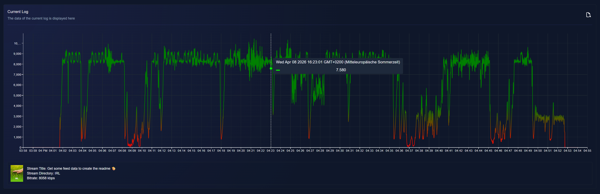
		</ul>
	<li>Feed-Statistiken:</li>
		<ul>
			<li>Aktuelle Bitrate - Aktualisierung alle 1000 ms</li>
			<li>Aktuelle Geschwindigkeit - Aktualisierung alle 1000 ms</li>
			<li>Aktuelle Uptime - setzt sich nach Neustart des Feeds zurück</li>
			<li>Gesamte Uptime - setzt sich bei App-Neustart zurück</li>
		</ul>
	<li>Verbindungsstatus:</li>
		<ul>
			<li>Grau: Keine Verbindung</li>
			<li>Orange: Nicht alles verbunden</li>
			<li>Grün: Verbunden</li>
			<li>Rot: Verbindungsfehler</li>
		</ul>
	<li>Aktive Plattform und Name des Broadcaster-Kontos</li>
	<li>Sitzungs-Log-Viewer</li>
</ul>
</details>

---

# Plattform-Setup

<details>
	<summary>Alle Plattform-Einstellungen anzeigen</summary>

<div >
	<ul>
		<li>
			Mehrere Plattformen aktivieren oder deaktivieren
		</li>
		<li>
			Beim Aktivieren/Deaktivieren einer Plattform verbindet sich die App automatisch mit allen aktivierten Plattformen neu
		</li>
	</ul>
</div>

### Chat-Befehle

- Befehle werden über alle Plattformen geteilt
- Änderungen gelten global (Aliasse, Rollen, Aktivierungsstatus)

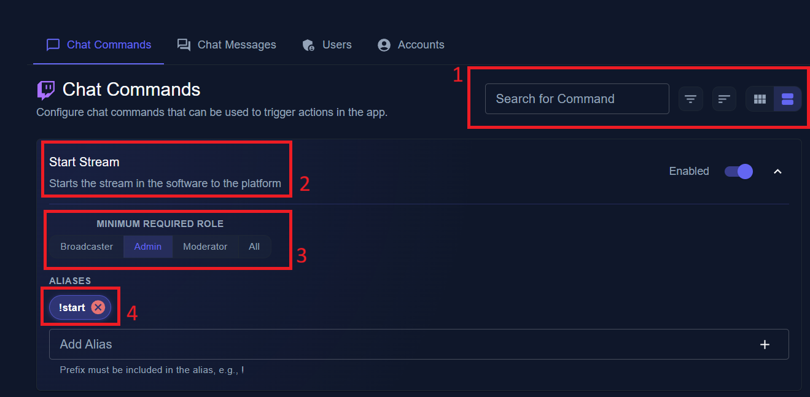

<ol>
	<li>Suche-/Layout-Bereich</li>
	<ul>
		<li>
			Alle geänderten Sortier-/Filter-/Layout-Status werden in den Konfigurationen gespeichert.
		</li>
		<li>
			Suchfeld - Suche Befehle nach Name oder Alias
		</li>
		<li>
			Filtern/Sortieren - Befehle sortieren und filtern
		</li>
		<li>
			Layout - Zwischen Listen- und Raster-Layout wechseln
		</li>
	</ul>
	<li>Befehlsname</li>
	<ul>
		<li>
			Der Befehlsname (über das Suchfeld durchsuchbar)
		</li>
	</ul>
	<li>Minimal erforderliche Rolle</li>
	<li>Cooldowns</li>
	<ul>
		<li>Alle: Cooldown gilt für alle (inklusive Broadcaster und Admins)</li>
		<li>Moderator: Cooldown gilt für Moderatoren und Benutzer mit niedrigeren Berechtigungen</li>
		<li>Benutzer: Cooldown nur für die Rolle "Alle"</li>
	</ul>
	<li>Aliasse</li>
	<ul>
		<li>
			Jeder Alias hat seinen eigenen Chip
		</li>
		<li>
			Der Befehlsalias muss das erste Wort sein
		</li>
		<li>
			Das gewünschte Präfix muss im Alias enthalten sein, z. B. !start 
		</li>
	</ul>
</ol>

- Alle Befehle zur Chat-Steuerung
<table>
	<thead>
		<tr>
			<th>BEFEHLSAKTION</th>
			<th>BESCHREIBUNG</th>
			<th>STANDARD-ALIASE</th>
			<th>STANDARD-MIN.-ROLLE</th>
			<th>ARGUMENTE </br> (erforderlich)</th>
			<th>BEISPIEL</th>
		</tr>
	</thead>
	<tbody>
		<tr>
			<td>start_stream</td>
			<td>
				<div>
					Startet den Stream
				</div>
				<h6>
					<u>Für YouTube nur in geplanten Stream-Chats</u>
				</h6>
			</td>
			<td>!start</td>
			<td>Broadcaster</td>
			<td></td>
			<td></td>
		</tr>
		<tr>
			<td>stop_stream</td>
			<td>Stoppt den Stream</td>
			<td>!stop</td>
			<td>Broadcaster</td>
			<td></td>
			<td></td>
		</tr>
		<tr>
			<td>add_admin</td>
			<td>Fügt einen neuen Admin hinzu</td>
			<td>!addadmin</td>
			<td>Broadcaster</td>
			<td>userName</td>
			<td>!addadmin yinks87</td>
		</tr>
		<tr>
			<td>remove_admin</td>
			<td>Entfernt einen vorhandenen Admin</td>
			<td>!removeadmin</td>
			<td>Broadcaster</td>
			<td>userName</td>
			<td>!removeadmin yinks87</td>
		</tr>
		<tr>
			<td>add_mod</td>
			<td>Fügt einen neuen Moderator hinzu</td>
			<td>!addmod</td>
			<td>Admin</td>
			<td>userName</td>
			<td>!addmod yinks87</td>
		</tr>
		<tr>
			<td>remove_mod</td>
			<td>Entfernt einen Moderator</td>
			<td>!removemod</td>
			<td>Admin</td>
			<td>userName</td>
			<td>!removemod yinks87</td>
		</tr>
		<tr>
			<td>switch_to_live</td>
			<td>Wechselt zur Live-Szene</td>
			<td>!live</td>
			<td>Admin</td>
			<td></td>
			<td></td>
		</tr>
		<tr>
			<td>switch_to_low</td>
			<td>Wechselt zur Low-Szene</td>
			<td>!low</td>
			<td>Admin</td>
			<td></td>
			<td></td>
		</tr>
		<tr>
			<td>switch_to_offline</td>
			<td>Wechselt zur Offline-Szene</td>
			<td>!offline</td>
			<td>Admin</td>
			<td></td>
			<td></td>
		</tr>
		<tr>
			<td>switch_to_privacy</td>
			<td>Wechselt zur Privacy-Szene</td>
			<td>!privacy</td>
			<td>Admin</td>
			<td></td>
			<td></td>
		</tr>
		<tr>
			<td>switch_to_starting</td>
			<td>Wechselt zur Starting-Szene</td>
			<td>!intro</td>
			<td>Admin</td>
			<td></td>
			<td></td>
		</tr>
		<tr>
			<td>enable_switcher</td>
			<td>Aktiviert den Switcher-Service</td>
			<td>!switcherenable, !switcheron, !switcherstart</td>
			<td>Admin</td>
			<td></td>
			<td></td>
		</tr>
		<tr>
			<td>disable_switcher</td>
			<td>Deaktiviert den Switcher-Service</td>
			<td>!switcherdisable, !switcheroff, !switcherstop</td>
			<td>Admin</td>
			<td></td>
			<td></td>
		</tr>
		<tr>
			<td>switch_to_scene</td>
			<td>Szene wechseln</td>
			<td>!switch, !ss</td>
			<td>Moderator</td>
			<td>sceneName</td>
			<td>!switch low</td>
		</tr>
		<tr>
			<td>refresh_stream</td>
			<td>Aktualisiert den Stream</td>
			<td>!refresh, !fix</td>
			<td>Moderator</td>
			<td></td>
			<td></td>
		</tr>
		<tr>
			<td>set_trigger</td>
			<td>Setzt den Trigger auf den Low-Schwellwert</td>
			<td>!trigger</td>
			<td>Moderator</td>
			<td>value</td>
			<td>!trigger 500</td>
		</tr>
		<tr>
			<td>set_rTrigger</td>
			<td>Setzt den Trigger auf den Live-Schwellwert</td>
			<td>!rtrigger</td>
			<td>Moderator</td>
			<td>value</td>
			<td>!rtrigger 1200</td>
		</tr>
		<tr>
			<td>add_alias</td>
			<td>Setzt einen Alias für einen Befehl</td>
			<td>!addalias</td>
			<td>Moderator</td>
			<td>bestehender Alias, neuer Alias</td>
			<td>!addalias !live !L</td>
		</tr>
		<tr>
			<td>remove_alias</td>
			<td>Entfernt einen Alias</td>
			<td>!removealias</td>
			<td>Moderator</td>
			<td>bestehender Alias</td>
			<td>!removealias !L</td>
		</tr>
		<tr>
			<td>bitrate</td>
			<td>Gibt die Bitrate-Nachricht zurück</td>
			<td>!bitrate, !b</td>
			<td>User</td>
			<td></td>
			<td></td>
		</tr>
	</tbody>
</table>

##

### Chat-Nachrichten

- Nachrichten werden über alle Plattformen geteilt
- Können ausgelöst werden:
  - Manuell per Befehl
  - Automatisch über Switcher-Events

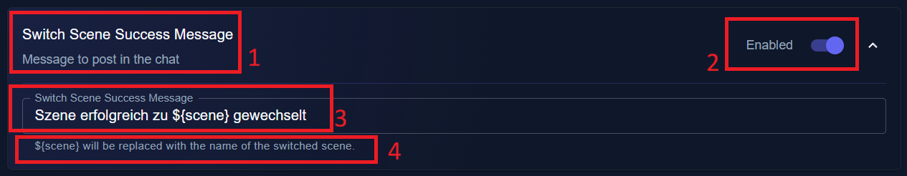

<ol>
	<li>Nachrichtenname</li>
	<ul>
		<li>
			Der Name der Nachricht, nach dem du im Suchfeld suchen kannst
		</li>
	</ul>
	<li>Aktivierungsstatus</li>
		<ul>
		<li>
			Wenn die Nachricht deaktiviert ist, wird sie nicht gepostet
		</li>
		<li>
				Der Nachrichtentext (mit oder ohne mögliche Variablen)
		</li>
	</ul>
	<li>Hinweis</li>
		<ul>
		<li>
			Der Hinweis mit Variablenbeschreibung. Das Variablenformat muss exakt wie in der Hinweis-Variable sein
		</li>
	</ul>
</ol>

##

### Benutzer-Einstellungen

- Erfordert ein angemeldetes Broadcaster-Konto
- Von APIs werden nur öffentliche Benutzerdaten angefragt
- In der App hinzugefügte Benutzer benötigen keine Rollen auf der Plattform
- Plattform-Moderatoren werden automatisch als Mods erkannt

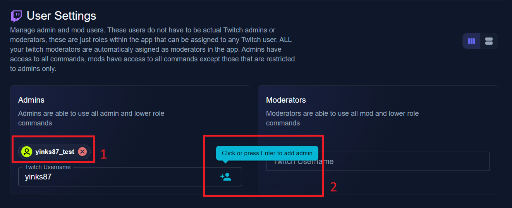

<ol>
	<li>Benutzer für die Rollengruppe</li>
	<ul>
			<li>
			Liste der Benutzer pro Gruppe
		</li>
		<li>
			Benutzer werden durch Klick auf das Kreuz im Benutzer-Chip entfernt (Benutzerdaten werden dauerhaft gelöscht)
		</li>
	</ul>
	<li>Einen Benutzer hinzufügen</li>
	<ul>
		<li>
			Gib den Benutzernamen in das Rollen-Textfeld ein. Der Name muss exakt dem Plattform-Namen entsprechen
		</li>
		<li>
			Nach Klick auf den Speichern-Button oder Drücken von Enter wird der API-Call für die Benutzerdaten ausgeführt. Wenn kein Benutzer gefunden wird, erscheint eine Fehlermeldung, andernfalls wird der Chip für den Benutzer angezeigt
		</li>
	</ul>
</ol>

##

### Konto-Einstellungen

- Broadcaster-Login für die aktive Plattform ist erforderlich
- Chatbot-Konto ist optional (nur für Twitch oder Kick)
- YouTube unterstützt kein alternatives Chatbot-Konto zum Senden von Nachrichten

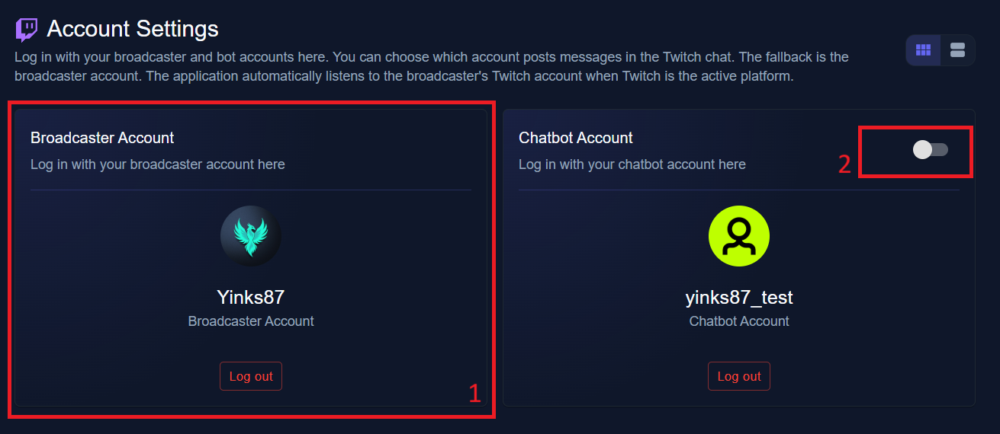

<ol>
	<li>Konto-Karte</li>
	<ul>
		<li>
			Benutzerinformationen und Logout-Button. Nach dem Logout werden alle Benutzerdaten gelöscht und die User-Access-Tokens widerrufen
		</li>
		<li>
			Wenn kein Benutzer eingeloggt ist, erscheint ein Login-Button. Nach Klick auf den Login-Button startet automatisch der Authorization-Code-Flow im Standardbrowser deines Rechners. Nach der Autorisierung werden die Benutzerdaten automatisch in der App gespeichert und Bild sowie Name des Benutzers erscheinen in der Benutzerkarte
		</li>
	</ul>
	<li>Chatbot aktivieren</li>
	<ul>
		<li>
			Aktiviere den Schalter, um das Chatbot-Konto zum Senden von Nachrichten im Plattform-Chat zu verwenden
		</li>
	</ul>
</ol>

### YouTube-Informationen

- Bei YouTube musst du den Namen des Broadcasters in das Textfeld eintragen. Nach dem Login öffnet sich ein Fenster zum Login des YouTube-Benutzers, den du im Textfeld eingetragen hast

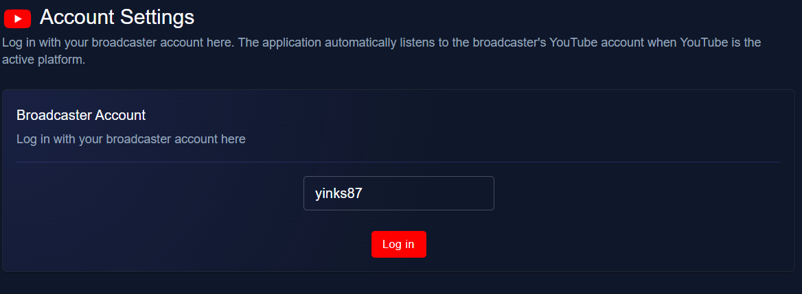

- Dieser Schritt ist sehr wichtig, ohne Login funktioniert der Chatbot nicht

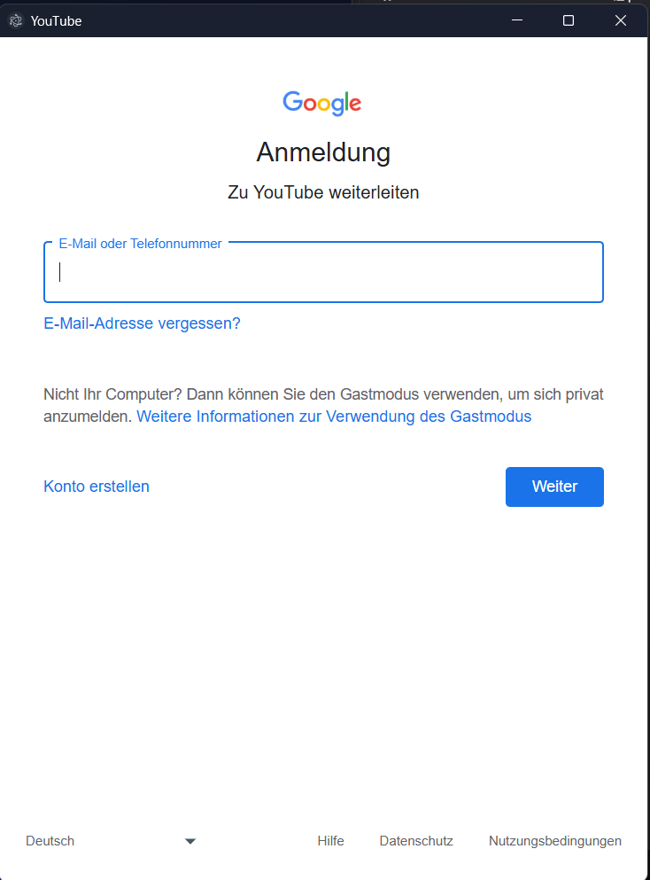

- Der beste Weg, damit die App sicher den Chat eines Livestreams liest, ist die Planung des Streams
  - Bei nicht geplanten YouTube-Livestreams kann das Chat-Listening fehlerhaft sein

</details>

---

# Server-Setup

<details>
	<summary>Alle Server-Einstellungen anzeigen</summary>

- Der Bitrate Monitor hört auf alle aktiven Serverinstanzen
- Die oberste Instanz ist die "Primary Instance"
  - Statistiken werden im Live-Diagramm angezeigt
  - Statistiken werden in den Sitzungs-Logs protokolliert
- Um eine Instanz als Primary Instance festzulegen, ziehe sie per Drag & Drop an den Anfang der Liste
  - Nach dem Umordnen startet das Abrufen der Statistiken automatisch neu

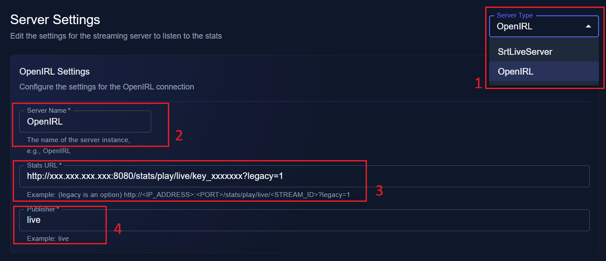

<ol>
	<li>
		Eine Serverinstanz hinzufügen
	</li>
	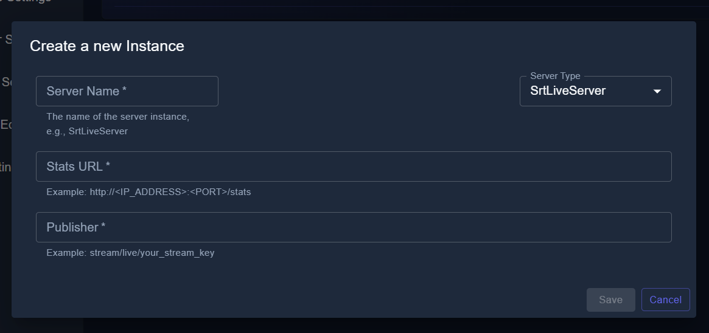
	<ul>
		<li>
			Neue Instanzen sind deaktiviert
		</li>
		<li>
			Servertyp-Auswahl
		</li>
		<li>
			Servername: Der Name wird fürs Logging verwendet und im Verbindungsstatus angezeigt
		</li>
		<li>
			Stats-URL: Die URL zum Auslesen der Feed-Statistiken
		</li>
		<li>
			Publisher
		</li>
	</ul>
	<li>
		Instanz bearbeiten
	</li>
	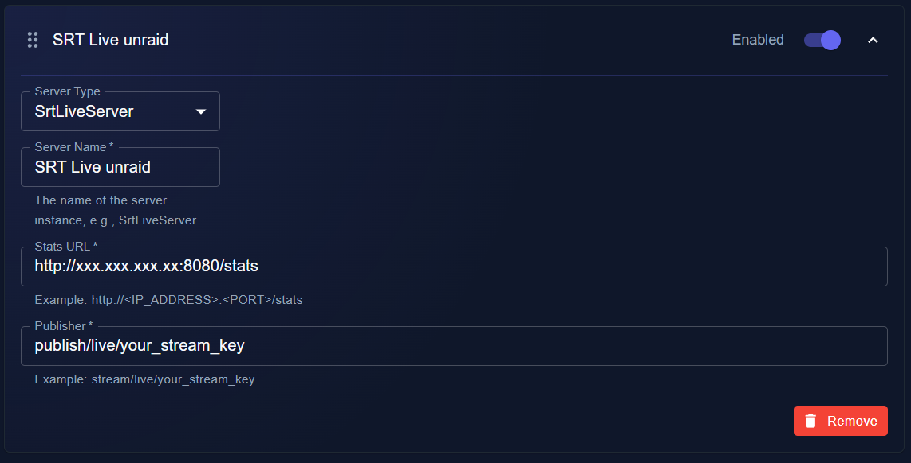
	<ul>
		<li>
			Bearbeite beliebige Einstellungen, deaktiviere/aktiviere die Instanz oder entferne sie
		</li>
	</ul>
</ol>

</details>

---

# Software-Setup

<details>
	<summary>Alle Einstellungen zur Broadcasting-Software anzeigen</summary>

- Die Broadcasting-Software ist dauerhaft mit der App verbunden. Basierend auf den Feed-Informationen, die aus den Server-Statistiken gelesen werden, wechselt der Bitrate Monitor die Szenen in der Broadcasting-Software

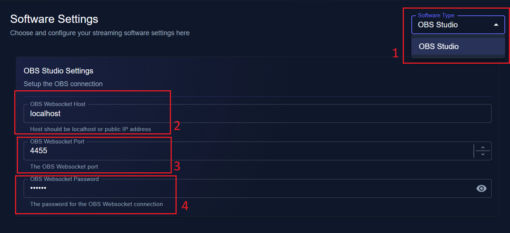

<ol>
	<li>
		Softwaretyp
	</li>
	<ul>
		<li>
			Typ der Broadcasting-Software - Aktuell wird OBS Studio unterstützt (mehr geplant)
		</li>
	</ul>
	<li>
		WebSocket-Host
	</li>
	<ul>
		<li>
			Die öffentliche oder lokale Adresse für den WebSocket
		</li>
	</ul>
	<li>
		WebSocket-Port
	</li>
	<ul>
		<li>
			Der Port des WebSockets
		</li>
	</ul>
	<li>
		WebSocket-Passwort
	</li>
	<ul>
		<li>
			Passwort (optional, kann in mancher Software auch API-Token heißen)
		</li>
	</ul>
</ol>

</details>

---

# Switcher-Setup

<details>
	<summary>Alle Switcher-Einstellungen anzeigen</summary>

- Der Switcher wechselt Szenen automatisch basierend auf Bitrate-Bedingungen.

### Wechsel-Logik

- Wechsel von Offline/Starting zu Live ohne aktiven Feed: Eine der Instanzen liegt über dem "to live"-Schwellwert
- Wechsel von Live zu Low: Alle aktiven Feeds müssen unter dem "to low"-Schwellwert liegen
- Wechsel von Low zurück zu Live: Die "Primary Instance" liegt über dem "to live"-Schwellwert zur Wiederherstellung
  - Bleibt die "Primary Instance" unter dem Schwellwert und alle anderen Instanzen liegen darüber, wechselt der Switcher <b> NICHT </b> zurück auf Live

##

### Aktivierungszustände des Switchers

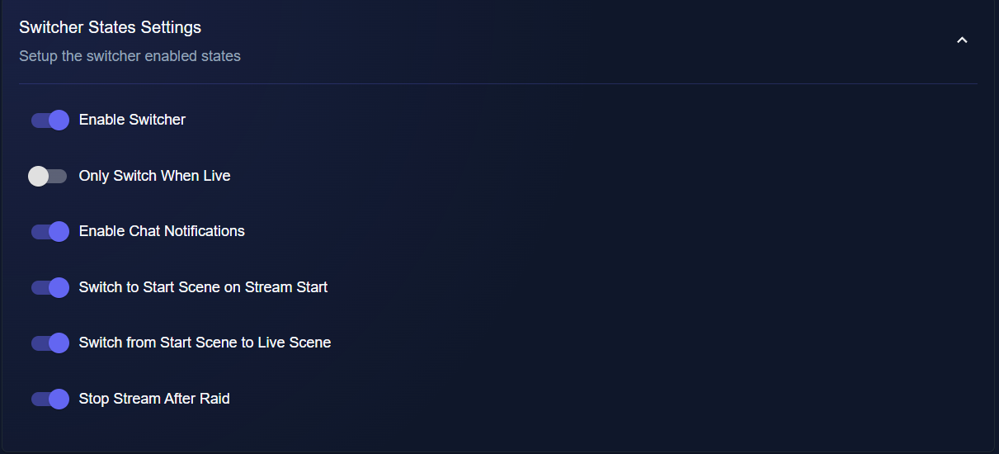

<ol>
	<li>
		Switcher aktivieren
	</li>
	<ul>
		<li>
			Switcher aktivieren/deaktivieren
		</li>
	</ul>
	<li>
		Nur wechseln, wenn live
	</li>
	<ul>
		<li>
			Wechselt nur automatisch, wenn der Status der Broadcasting-Software "live streaming" ist
		</li>
	</ul>
	<li>
		Chat-Benachrichtigungen aktivieren
	</li>
	<ul>
		<li>
			Aktiviert/deaktiviert Chat-Ausgaben für automatische Wechsel. Nur aktivierte Nachrichten können verwendet werden.
		</li>
	</ul>
	<li>
		Beim Stream-Start auf Start-Szene wechseln
	</li>
	<ul>
		<li>
			Wechselt beim Auslösen von Stream-Start per Befehl automatisch zur Start-Szene (nicht beim Broadcaster-Start)
		</li>
	</ul>
	<li>
		Von Start-Szene zur Live-Szene wechseln
	</li>
	<ul>
		<li>
			Ist automatisches Wechseln von Start-Szene deaktiviert, ist ein manueller Wechsel erforderlich
		</li>
	</ul>
	<li>
		Stream nach Raid stoppen
	</li>
	<ul>
		<li>
			Nach einem Raid zu einem anderen Broadcaster stoppt der Switcher den Stream in der Broadcasting-Software automatisch
		</li>
	</ul>
</ol>

##

### Switcher-Szenen-Einstellungen

- Richte die Szenen für den Switcher ein. Die Szenennamen müssen mit den Szenen in deiner Broadcasting-Software übereinstimmen. Stimmen sie nicht überein, kann der Switcher nicht zur Szene wechseln

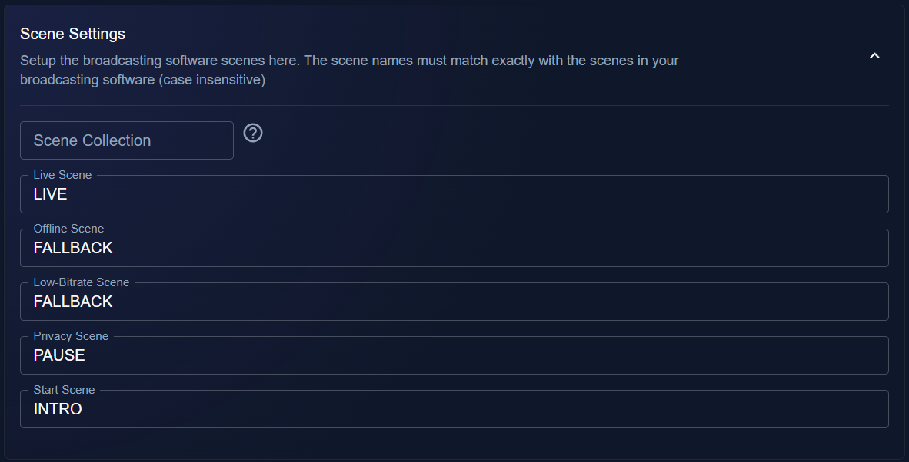

<ol>
    <li>
      Szenensammlung
    </li>
    <ul>
      <li>
				Die Szenensammlung in der Streaming Software mit den Szene für die Anwendung. Ist das Textfeld leer, wird die aktuelle Szenensammlung verwendet. Ist eine Sammlung eingetragen, versucht die Anwendung beim Stream Start Befehl in die eingetragene Szenensammlung zu wechseln.
      </li>
    </ul>
    <li>
    	Live-Szene
    </li>
    <ul>
    	<li>
    		Die Haupt-Live-Szene. Diese Szene wird genutzt, wenn der Bitrate-Schwellwert im Bereich für das Live-Bild im Stream liegt
    	</li>
    </ul>
    <li>
    	Offline-Szene
    </li>
    <ul>
    	<li>
    		Diese Szene wird genutzt, wenn der Schwellwert unter dem Off-Trigger-Wert liegt
    	</li>
    </ul>
    <li>
    	Low-Bitrate-Szene
    </li>
    <ul>
    	<li>
    		Diese Szene wird genutzt, wenn der Schwellwert unter dem Live-Trigger und über dem Off-Trigger-Wert liegt
    	</li>
    </ul>
    <li>
    	Privacy-Szene
    </li>
    <ul>
    	<li>
    		Die Privacy-Szene ist eine spezielle Szene für private Momente. Der Switcher verlässt diese Szene nie automatisch, solange kein manuelles Ereignis ausgelöst wird. Die Szene kann außerdem geschützt werden, das heißt: Der Befehl zum Szenenwechsel kann eingeschränkt werden, sodass niemand ohne erforderliche Berechtigung die Privacy-Szene verlassen kann. Das Wechseln in die Privacy-Szene ist nicht eingeschränkt.
    	</li>
    	<li>
    	<b><u>Diese Szene muss einen eindeutigen Namen haben! Keine andere Szene darf denselben Namen wie die Privacy-Szene haben!</u></b>
    	</li>
    </ul>
    <li>
    	Intro-Szene
    </li>
    <ul>
    	<li>
    		Die Szene, zu der der Switcher wechselt, wenn die Option "Beim Stream-Start auf Start wechseln" aktiviert ist
    	</li>
    </ul>

</ol>
  
##

### Switcher-Trigger-Einstellungen

- Richte Trigger-Schwellwerte und Verzögerungen ein, bevor der Switcher die Szene wechselt

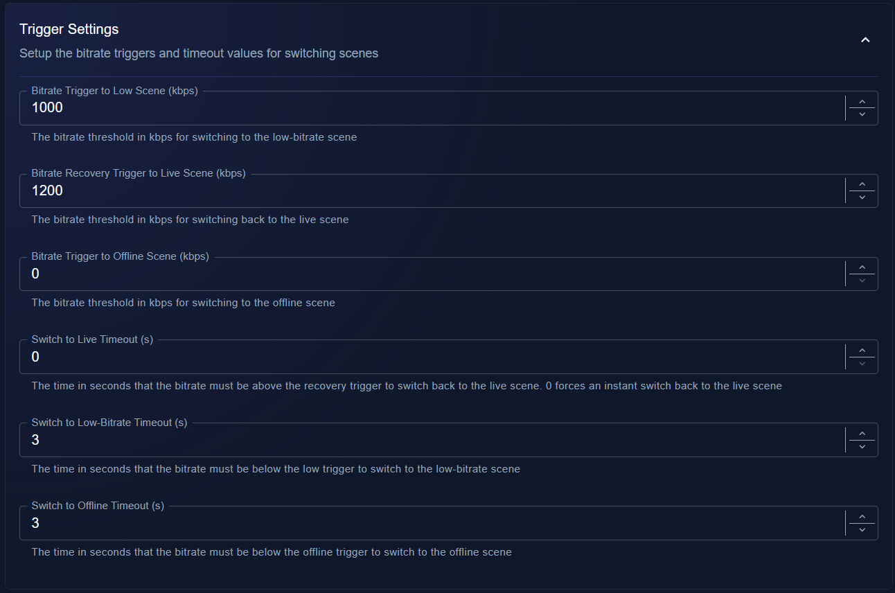

<ol>
	<li>
		Bitrate-Trigger zur Low-Szene
	</li>
	<ul>
		<li>
			Wenn die aktuelle Bitrate gleich oder kleiner diesem Wert ist, wechselt der Switcher nach Ablauf der Verzögerungszeit zur Low-Bitrate-Szene.
		</li>
	</ul>
	<li>
		Bitrate-Recovery-Trigger
	</li>
	<ul>
		<li>
			Wenn die aktuelle Bitrate gleich oder größer diesem Wert ist, wechselt der Switcher nach Ablauf der Verzögerungszeit zur Live-Szene.
		</li>
		<li>
			Wenn die Verzögerungszeit auf 0 gesetzt ist, wechselt der Switcher sofort zurück zur Live-Szene
		</li>
	</ul>
	<li>
		Bitrate-Offline-Trigger
	</li>
	<ul>
		<li>
			Wenn die aktuelle Bitrate gleich oder kleiner diesem Wert ist, wechselt der Switcher zur Offline-Szene
		</li>
	</ul>
	<li>
		Timeout für Wechsel zu Live
	</li>
	<ul>
		<li>
			Zeit in Sekunden, die die aktuelle Bitrate über dem Bitrate-Schwellwert liegen muss, bevor der Switcher tatsächlich die Szene wechselt.
		</li>
		<li>
			Setze den Wert auf 0, um eine sofortige Wiederherstellung zur Live-Szene zu erzwingen
		</li>
		<li>
		</li>
	</ul>
	<li>
		Timeout für Wechsel zu Low
	</li>
	<ul>
		<li>
			Zeit in Sekunden, die die aktuelle Bitrate unter dem Bitrate-Schwellwert liegen muss, bevor der Switcher tatsächlich die Szene wechselt
		</li>
	</ul>
	<li>
		Timeout für Wechsel zu Offline
	</li>
	<ul>
		<li>
			Zeit in Sekunden, die die aktuelle Bitrate unter dem Bitrate-Schwellwert liegen muss, bevor der Switcher tatsächlich die Szene wechselt
		</li>
	</ul>
</ol>

</details>

---

# Logging-Setup

<details>
	<summary>Logging-Einstellungen konfigurieren</summary>

- Richte Logging für Session-Feed-Logs und Action-Logs ein
- Die Logs werden in den definierten Pfaden gespeichert

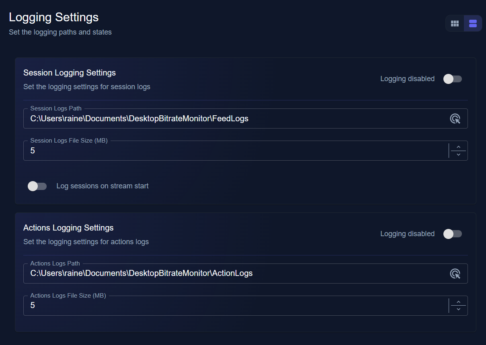

1. Session-Logging-Einstellungen
   - Logging für Session-Daten aktivieren/deaktivieren
   - Pfad/Verzeichnis für die Log-Speicherung
   - Maximale Dateigröße pro Log - Logs werden nach Erreichen der Größe aufgeteilt
   - Startpunkt für Logging festlegen (App- oder Broadcasting-Start)

2. Action-Logging-Einstellungen
   - Action-Logging aktivieren/deaktivieren
   - Pfad/Verzeichnis für die Log-Speicherung
   - Maximale Dateigröße pro Log - Logs werden nach Erreichen der Größe aufgeteilt

</details>

---

# Overlay-Setup

<details>
	<summary>Dein Overlay einrichten</summary>

- Zeige deine Live-Feed-Statistiken in deinem Stream an
- Einfacher Modus oder Expertenmodus verfügbar

### URL-Einstellungen

<ol>
	<li>Zwischen Einfach-/Expertenmodus wechseln</li>
		<li>Änderungen speichern und an dein Live-Overlay übertragen</li>
		<ul>
		<li>Nicht gespeicherte Änderungen gehen beim Wechsel zu einer anderen Einstellungsseite verloren</li>
		<li><b>HINWEIS</b>Der Moduswechsel benötigt einen Speichern-Klick, damit die Änderung im Live-Overlay sichtbar wird!</li>
		</ul>
	<li>Element per Drag & Drop ziehen, um automatisch ein Overlay in deiner Software hinzuzufügen</li>
	<li>Auf das URL-Feld klicken, um die URL in die Zwischenablage zu kopieren</li>
	<li>Jede Änderung wird in der Vorschau in Echtzeit angezeigt</li>
	<li><b>Vergiss nicht, deine Änderungen zu speichern, damit sie in deinem Live-Overlay sichtbar werden</b></li>

</ol>

##

### Einfacher Modus

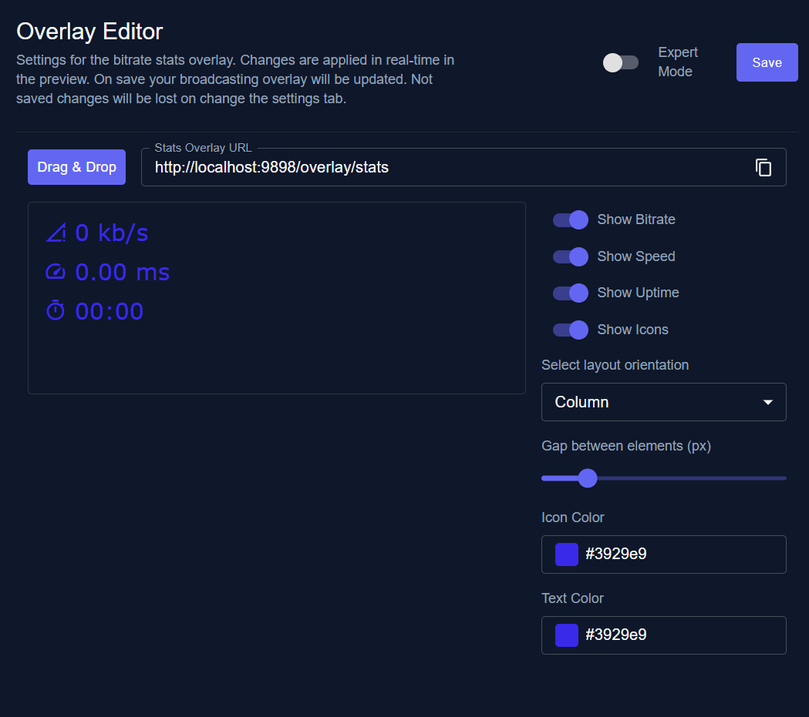

- Sichtbarkeit der Elemente ändern
- Einige Farben oder Ausrichtungen ändern

##

### Entwickler-Modus

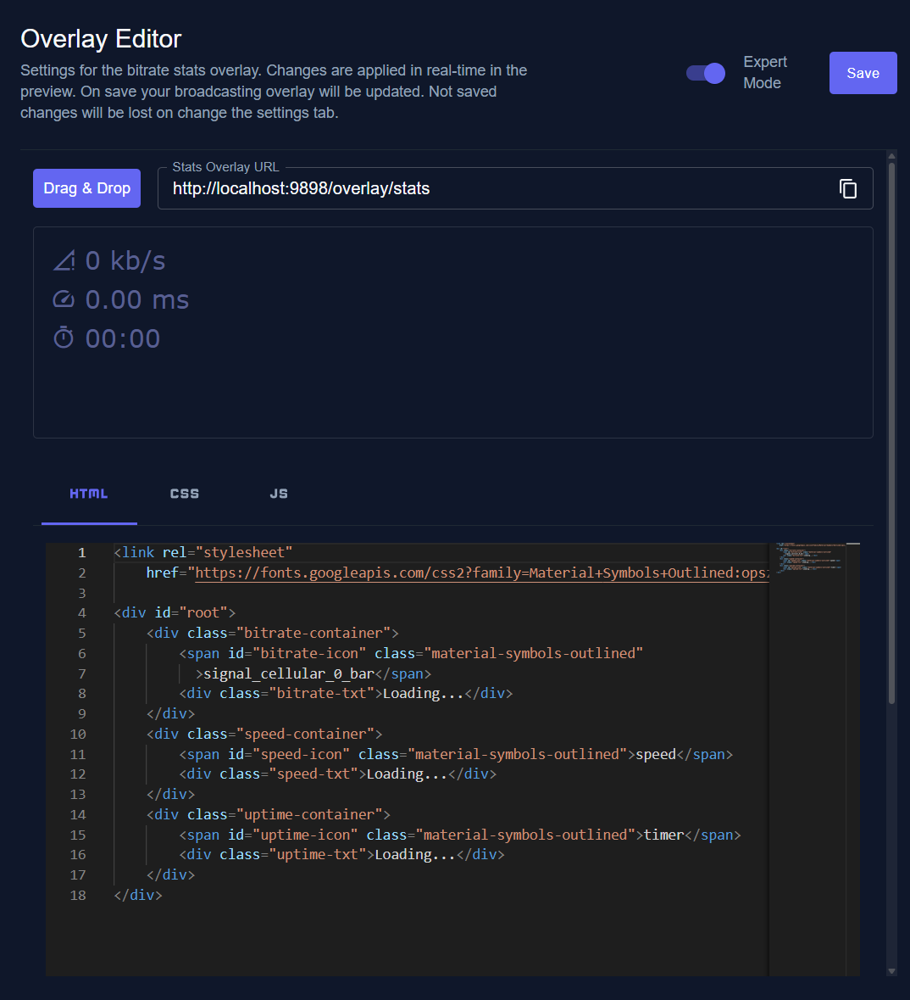

- Bearbeite das Overlay mit rohem HTML, CSS, JS
- jQuery wird unterstützt
- Das PROPS-Objekt enthält die Standardzustandswerte

```javascript
const { bitrate, speed, uptime } = PROPS;

// Die aktuelle Bitrate des eingehenden Feeds
bitrate;
// Die aktuelle Geschwindigkeit (rtt) des eingehenden Feeds
speed;
// Die aktuelle Uptime des eingehenden Feeds
uptime;
```

</details>

---

# App-Einstellungen

<details>
	<summary>Alle allgemeinen App-Einstellungen anzeigen</summary>

### Allgemein

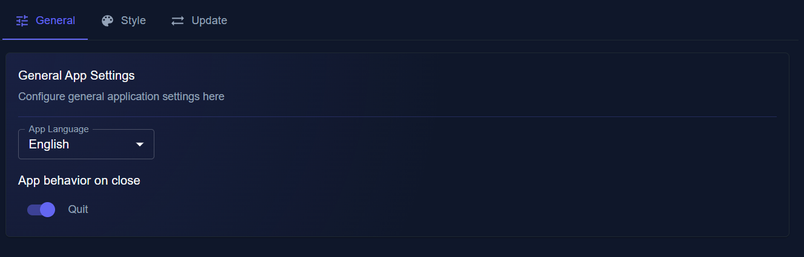

<ol>
	<li>
		App-Sprache
	</li>
	<ul>
		<li>
			Wähle die App-Sprache für das Frontend
		</li>
		<li>
			Das ändert keine Befehle oder Nachrichten. Befehle und Nachrichten werden abhängig von deinem System geladen.
		</li>
	</ul>
	<li>
		App-Verhalten beim Schließen
	</li>
	<ul>
		<li>
			Lege fest, ob die App beim Schließen beendet oder minimiert wird.
		</li>
	</ul>
</ol>

##

### Stil

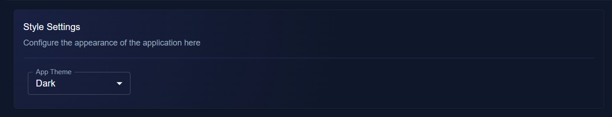

<ol>
	<li>
		App-Theme
	</li>
	<ul>
		<li>
			Wähle das Theme für das Frontend
		</li>
	</ul>
</ol>

##

### Update

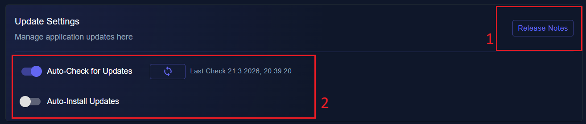

<ol>
	<li>
		Release Notes
	</li>
	<ul>
		<li>
			Öffnet die Release Notes der aktuell installierten App-Version im Standardbrowser deines Rechners
		</li>
	</ul>
		<li>
		Automatisch nach Updates suchen
	</li>
	<ul>
		<li>
			Beim App-Start ruft die App den Update-Server auf und sucht nach einem möglichen Update. Wenn ein Update gefunden wird, werden die Release Notes in einem Fenster angezeigt. In diesem Fenster kannst du entscheiden, ob du die Anwendung aktualisieren möchtest
		</li>
	</ul>
	<li>
		Updates automatisch installieren
	</li>
	<ul>
		<li>
			Die App installiert Updates automatisch, wenn eines gefunden wird. Die Installation läuft beim App-Start.
		</li>
	</ul>
	<li>
		Manuell nach Updates suchen
	</li>
	<ul>
		<li>
			Starte manuell eine Prüfung, ob ein Update verfügbar ist, und öffne eine Information, ob eines vorhanden ist oder nicht
		</li>
		<li>
			Nach jeder Prüfung (automatisch oder manuell) wird der Zeitstempel gespeichert und im Label angezeigt
		</li>
	</ul>
</ol>

##

### Backup

- Erstelle oder importiere ein Backup aller Einstellungen
- Schalter-Zustände gelten nur für die Export-Auswahl
- Import ist immer vollständig, da beim Export alle Daten erstellt werden. Schalter-Zustände haben darauf keinen Einfluss

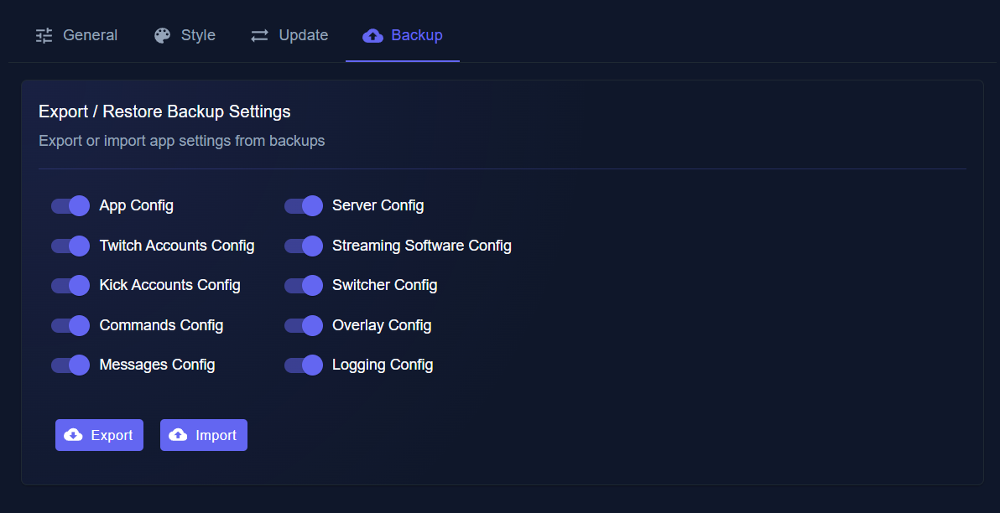

- Wähle die Einstellungen für den Export
- Export- oder Import-Button öffnet den Speichern- bzw. Lade-Dialog

</details>

---

# HILFE

## Hier findest du die häufigsten Fragen aus der Community und eventuell Hilfe für dein Problem

<table>
	<thead>
		<tr>
			<th>PROBLEM</th>
			<th>MÖGLICHKEITEN</th>
			<th>MÖGLICHE LÖSUNGEN</th>
		</tr>
	</thead>
	<tbody>
		<tr>
			<td>Der Switcher beginnt nicht zu wechseln</td>
			<td>
				<ul>
					<li>
						Die Broadcasting-Software befindet sich nicht in einer umschaltbaren Szene
					</li>
					<li>
						Die Broadcasting-Software ist nicht mit dem Switcher verbunden
					</li>
					<li>
						Der Server liefert keine Stream-Feed-Statistiken
					</li>
				</ul>
			</td>
			<td>
				<ul>
					<li>
						Bringe die Broadcasting-Software manuell in eine umschaltbare Szene (Befehl zum Szenenwechsel). Nur Szenen in deinen Switcher-Einstellungen sind umschaltbare Szenen!
					</li>
					<li>
						Prüfe dein Verbindungs-Setup (läuft der WebSocket? Sind die Verbindungseinstellungen korrekt?) oder starte die Broadcasting-Software neu
					</li>
					<li>
						Prüfe die Serververbindung. Wenn im Feed-Diagramm auf dem Dashboard keine Live-Daten angezeigt werden, sendet der Server keine Daten oder das Setup ist falsch und die App kann nicht auf die Server-Statistiken zugreifen
					</li>
				</ul>
			</td>
		</tr>
		<tr>
			<td>Nach der Autorisierung erhalte ich im Browserfenster "server not reachable" oder "cannot get /oauth/..."</td>
			<td>
				<ul>
					<li>
						Die Firewall oder der Defender blockiert eingehende Daten
					</li>
				</ul>
			</td>
			<td>
				<ul>
					<li>
						Prüfe deine Firewall- oder Defender-Einstellungen und stelle sicher, dass die App für eingehende Nachrichten autorisiert ist</td>
					</li>
				</ul>
		</tr>
	</tbody>
</table>
